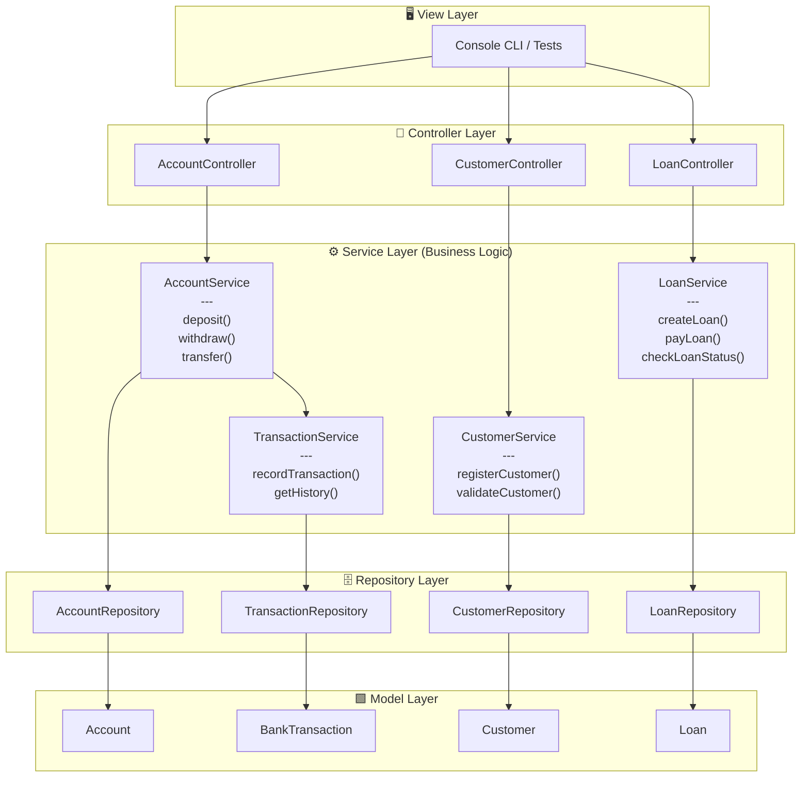

# 🧱 MVC Architecture in a Java Banking Project (Without Spring Boot)

This document explains the **Model–View–Controller (MVC)** architecture pattern using **plain Java and Maven**, before introducing frameworks like Spring Boot.  
Understanding this foundation will help to design clean, modular, and maintainable backend systems.

This project is a simple **banking system** built with **Java**, **Maven**, and an **H2** in-memory database.
It follows the **MVC (Model–View–Controller)** architectural pattern to organize the code cleanly and maintainably.

---

## 🧩 MVC Structure

**MVC** stands for:
- **Model** – Represents the data and business logic (e.g., `Account`, `Customer`, `Loan`, `Transaction`).
- **View** – Displays information (in this backend project, it could be a console interface or an API output).
- **Controller** – Receives user input, calls the model’s services, and sends back the response to the view.

Flow diagram:

```
User → Controller → Model (Business Logic + Data) → Controller → View
```
MVC Architecture Diagram for Bank Project

This diagram represents the MVC structure of the Bank project, including
all business logic methods.

# MVC Architecture Diagram for Bank Project




## 🧱 Typical Project Structure

```
bank-project/
 ├── src/main/java/com/example/bank/
 │    ├── model/
 │    │    ├── Account.java
 │    │    ├── Customer.java
 │    │    ├── Loan.java
 │    │    ├── Transaction.java
 │    │    ├── Currency.java            #This feature will be implemented in future versions.
 │    │    ├── AccountType.java         #This feature will be implemented in future versions.
 │    │    └── CurrencyAccountjava      #This feature will be implemented in future versions.
 │    ├── service/
 │    │    ├── AccountService.java
 │    │    ├── CustomerService.java
 │    │    ├── TransactionService.java
 │    │    └── LoanService.java
 │    ├── repository/
 │    │    ├── AccountRepository.java
 │    │    └── ...
 │    ├── controller/
 │    │    └── BankController.java
 │    └── App.java  (entry point)
 └── pom.xml
```

## 🔹 1. Model (M)

These are your **data classes** and everything related to data
persistence.\
In your case: `Account`, `Customer`, `Loan`, `BankTransaction`.\
Here you only define the attributes (e.g., `balance`, `loanAmount`) and
relationships.

Example — simple `Account` model:

```java
public class Account {
    private int id;
    private String owner;
    private double balance;

    // Constructor, getters, setters
    
}
```

The model can interact with data sources such as files, in-memory storage, or a database (like H2).

---

## 🔹 2. View (V)
The **user interface**.\

The **View** is responsible for **displaying information** to the user and receiving inputs.  
Without a web framework, this can be a **console interface** or a GUI (Swing, JavaFX, etc.).

Example — console-based `BankView`:

```java
public class BankView {
    public void showBalance(double balance) {
        System.out.println("Your current balance is: " + balance + " €");
    }

    public void showMessage(String message) {
        System.out.println(message);
    }
}
```

The View should not contain business logic — it only handles presentation and user interaction.

---

## 🔹 3. Controller (C)

The **Controller** acts as a **bridge between the View and the Model**.  
It receives user actions, updates the Model, and then refreshes the View with new data.

Example — `BankController`:

```java
public class BankController {
    private Account account;
    private BankView view;

    public BankController(Account account, BankView view) {
        this.account = account;
        this.view = view;
    }

    public void makeDeposit(double amount) {
        account.deposit(amount);
        view.showMessage("Deposit completed successfully.");
        view.showBalance(account.getBalance());
    }

    public void makeWithdrawal(double amount) {
        account.withdraw(amount);
        view.showBalance(account.getBalance());
    }
}
```

In `Main.java`, you typically create the objects and connect them:

```java
public class Main {
    public static void main(String[] args) {
        Account account = new Account();
        BankView view = new BankView();
        BankController controller = new BankController(account, view);

        controller.makeDeposit(100);
        controller.makeWithdrawal(40);
    }
}
```
---

## ⚙️ Business Logic

Business logic defines the **rules and behaviors of the banking domain** — not just data storage.

Examples:
- You can’t make a transfer if the account has insufficient funds.
- When creating a loan, the system must calculate the monthly payment.
- A customer can have multiple accounts.
- 
  **Where does business logic go in MVC?**

Usually, in a **Service layer** that sits between the Controller and the
Model.\
This keeps the Controller clean --- it only handles requests and sends
responses.

1. **Domain Classes (Entities)** → `Account`, `Customer`, `Loan`, `Transaction`
    - Hold attributes and simple behaviors.

2. **Service Classes (Business Logic)** → `AccountService`, `LoanService`, etc.
    - Contain methods such as `deposit()`, `withdraw()`, `transfer()`, etc.

3. **Repository or DAO Classes (Persistence)** → `AccountRepository`, etc.
    - Handle saving and reading data from H2.

---

```java
# 💡 Example: AccountService (Business Logic Layer)

This example shows how the **Service Layer** contains business logic in the MVC architecture.

java package com.bankalpy.service;

import com.bankalpy.model.Account;
import com.bankalpy.repository.AccountRepository;

public class AccountService {

    private final AccountRepository accountRepository;

    public AccountService(AccountRepository accountRepository) {
        this.accountRepository = accountRepository;
    }

    // Deposit money into an account
    public void deposit(Long accountId, double amount) {
        Account account = accountRepository.findById(accountId);
        account.setBalance(account.getBalance() + amount);
        accountRepository.update(account);
    }

    // Withdraw money if balance allows
    public void withdraw(Long accountId, double amount) {
        Account account = accountRepository.findById(accountId);
        if (account.getBalance() < amount) {
            throw new IllegalArgumentException("Insufficient funds.");
        }
        account.setBalance(account.getBalance() - amount);
        accountRepository.update(account);
    }
}
```
---

## 💡 Summary

- **Model:** Holds entities and business logic.
- **Controller:** Mediates between user actions and the model.
- **View:** Displays results to the user.
- **Goal:** Keep responsibilities clear and code modular, preparing for Spring integration later.

---