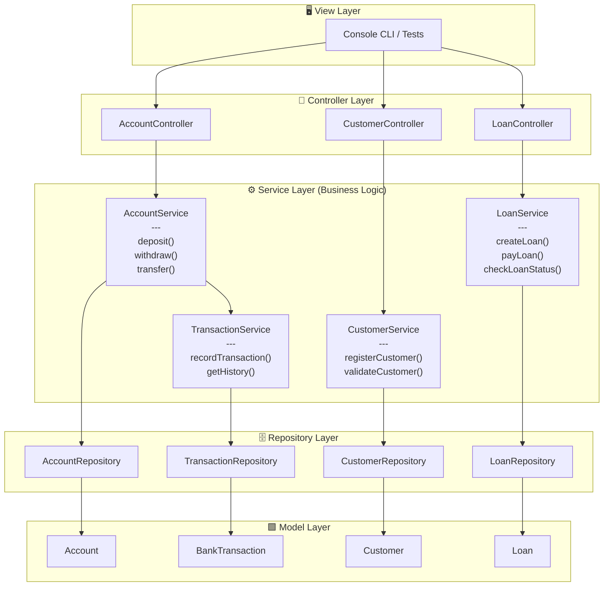

# 🧱 MVC Architecture in a Java Banking Project (Without Spring Boot)

This document explains the **Model–View–Controller (MVC)** architecture pattern using **plain Java and Maven**.  
Understanding this foundation will help you design clean, modular, and maintainable backend systems.

The project is a simple **banking system** built with **Java**, **Maven**, and an **H2** in-memory database, following MVC for code organization.

---

## 📋 Table of Contents

1. [MVC Structure](#🧩-mvc-structure)
2. [Typical Project Structure](#🧱-typical-project-structure)
3. [Model (M)](#🔹-1-model-m)
4. [View (V)](#🔹-2-view-v)
5. [Controller (C)](#🔹-3-controller-c)
6. [Business Logic & Service Layer](#⚙️-business-logic)
7. [Summary](#💡-summary)
8. [Further Reading](#📚-further-reading)

---

## 🧩 MVC Structure

**MVC** stands for:
- **Model** – Data and business logic (e.g., `Account`, `Customer`, `Loan`, `Transaction`).
- **View** – User interface (console, API output, or GUI).
- **Controller** – Handles user requests, interacts with the model, and updates the view.

**Flow diagram:**
```
User → Controller → Model (Business Logic + Data) → Controller → View
```
Below is an architecture diagram representing the structure of the Bank project, including major business logic components.

### MVC Architecture Diagram for Bank Project



---

## 🧱 Typical Project Structure

```
bank-project/
 ├── src/main/java/com/example/bank/
 │    ├── model/
 │    │    ├── Account.java
 │    │    ├── Customer.java
 │    │    ├── Loan.java
 │    │    ├── Transaction.java
 │    │    ├── Currency.java            # To be implemented in future versions
 │    │    ├── AccountType.java         # To be implemented in future versions
 │    │    └── CurrencyAccount.java     # To be implemented in future versions
 │    ├── service/
 │    │    ├── AccountService.java
 │    │    ├── CustomerService.java
 │    │    ├── TransactionService.java
 │    │    └── LoanService.java
 │    ├── repository/
 │    │    ├── AccountRepository.java
 │    │    ├── CustomerRepository.java
 │    │    ├── LoanRepository.java
 │    │    ├── TransactionRepository.java
 │    ├── controller/
 │    │    └── BankController.java
 │    └── App.java  (entry point)
 └── pom.xml
```
**Tip:** The project structure follows best practices for separating concerns, making future upgrades (like adding Spring Boot) easier.

---

## 🔹 1. Model (M)

**Models** are your data classes and everything related to data persistence.  
In this project: `Account`, `Customer`, `Loan`, `BankTransaction`.

Models define attributes (e.g., `balance`, `loanAmount`) and relationships, and may include simple validation.

**Example – simple `Account` model:**

```java
public class Account {
    private int id;
    private String owner;
    private double balance;

    // Constructor, getters, setters

    // Optional: basic validation
    public void setBalance(double balance) {
        if (balance < 0) throw new IllegalArgumentException("Balance cannot be negative.");
        this.balance = balance;
    }
}
```
Models interact with data sources such as files, memory, or databases (like H2).

---

## 🔹 2. View (V)

The **View** is responsible for displaying information and receiving user input.  
Without a web framework, this can be a **console interface**, a GUI (Swing, JavaFX), or API responses (for REST).

**Example – console-based `BankView`:**

```java
public class BankView {
    public void showBalance(double balance) {
        System.out.println("Your current balance is: " + balance + " €");
    }

    public void showMessage(String message) {
        System.out.println(message);
    }
}
```
> **Note:** The View should only handle presentation and user interaction—not business logic.

**Tip:** You can swap the View for a different interface (e.g., web frontend) without changing the Model or Controller logic.

---

## 🔹 3. Controller (C)

The **Controller** acts as a bridge between View and Model.  
It receives user actions, calls appropriate services, updates the Model, and refreshes the View as needed.

**Example – `BankController`:**

```java
public class BankController {
    private final AccountService accountService;
    private final BankView view;

    public BankController(AccountService accountService, BankView view) {
        this.accountService = accountService;
        this.view = view;
    }

    public void makeDeposit(long accountId, double amount) {
        try {
            accountService.deposit(accountId, amount);
            view.showMessage("Deposit completed successfully.");
            view.showBalance(accountService.getBalance(accountId));
        } catch (Exception e) {
            view.showMessage("Error: " + e.getMessage());
        }
    }

    public void makeWithdrawal(long accountId, double amount) {
        try {
            accountService.withdraw(accountId, amount);
            view.showBalance(accountService.getBalance(accountId));
        } catch (Exception e) {
            view.showMessage("Error: " + e.getMessage());
        }
    }
}
```

In `App.java`, you typically create and connect these objects:

```java
public class App {
    public static void main(String[] args) {
        AccountRepository repo = new AccountRepository();
        AccountService service = new AccountService(repo);
        BankView view = new BankView();
        BankController controller = new BankController(service, view);

        controller.makeDeposit(1L, 100);
        controller.makeWithdrawal(1L, 40);
    }
}
```
**Tip:** Controllers should remain thin and delegate business rules to the Service layer.

---

## ⚙️ Business Logic & Service Layer

Business logic defines the **rules and behaviors of the banking domain**—not just data storage.

**Examples:**
- You can’t make a transfer if the account has insufficient funds.
- When creating a loan, the system must calculate the monthly payment.
- A customer can have multiple accounts.

**Where does business logic go in MVC?**

Usually, in a **Service layer** between the Controller and the Model.  
This keeps Controllers clean—focused on handling requests and responses.

### Layers Recap

1. **Domain Classes (Entities):**  
   `Account`, `Customer`, `Loan`, `Transaction`  
   — Hold attributes and simple behaviors.

2. **Service Classes (Business Logic):**  
   `AccountService`, `LoanService`, etc.  
   — Contain methods such as `deposit()`, `withdraw()`, `transfer()`, with validation and error handling.

3. **Repository or DAO Classes (Persistence):**  
   `AccountRepository`, etc.  
   — Handle saving and reading data from H2.

**Repository Example:**
```java
public class AccountRepository {
    public Account findById(Long id) { /* ... */ }
    public void update(Account account) { /* ... */ }
}
```

**Service Example:**
```java
package com.bankalpy.service;

import com.bankalpy.model.Account;
import com.bankalpy.repository.AccountRepository;

public class AccountService {
    private final AccountRepository accountRepository;

    public AccountService(AccountRepository accountRepository) {
        this.accountRepository = accountRepository;
    }

    public void deposit(Long accountId, double amount) {
        Account account = accountRepository.findById(accountId);
        account.setBalance(account.getBalance() + amount);
        accountRepository.update(account);
    }

    public void withdraw(Long accountId, double amount) {
        Account account = accountRepository.findById(accountId);
        if (account.getBalance() < amount) {
            throw new IllegalArgumentException("Insufficient funds.");
        }
        account.setBalance(account.getBalance() - amount);
        accountRepository.update(account);
    }

    public double getBalance(Long accountId) {
        return accountRepository.findById(accountId).getBalance();
    }
}
```
---

## 💡 Summary

- **Model:** Defines entities and basic behaviors.
- **Controller:** Mediates between user actions and services.
- **View:** Displays results and receives input.
- **Service:** Contains business logic and validation.
- **Repository:** Manages data persistence.

**Goal:**  
Keep responsibilities clear and code modular—preparing for future framework integration (e.g., Spring Boot).

---

## 📚 Further Reading

- [Spring Framework: MVC Pattern](https://docs.spring.io/spring-framework/docs/current/reference/html/web.html#mvc)
- [Java MVC Design Pattern](https://www.geeksforgeeks.org/mvc-design-pattern/)
- [H2 Database Introduction](https://www.h2database.com/html/main.html)